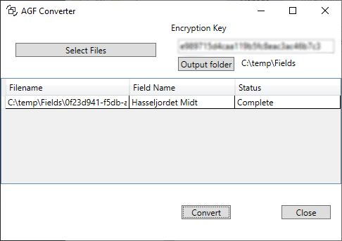

# AGF File Converter

Smal program for converting Trimble AGF files to KML for universal use of field geometry.

Thanks to [mwdevries](https://www.thecombineforum.com/threads/import-files-from-gfx750-into-sms-basic.336677/page-2#post-3469990) in "The Combine Forum" for help decrypting the file.
Decrypt key can be found in the forume under "numArray"

 

I have no files to test other geometry in the files than Polygon, if someone have other files that not can be read please send me file so i can implement that geometry too.
